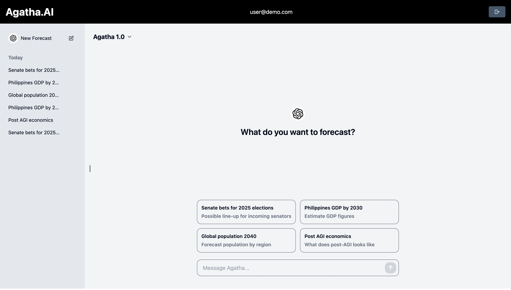
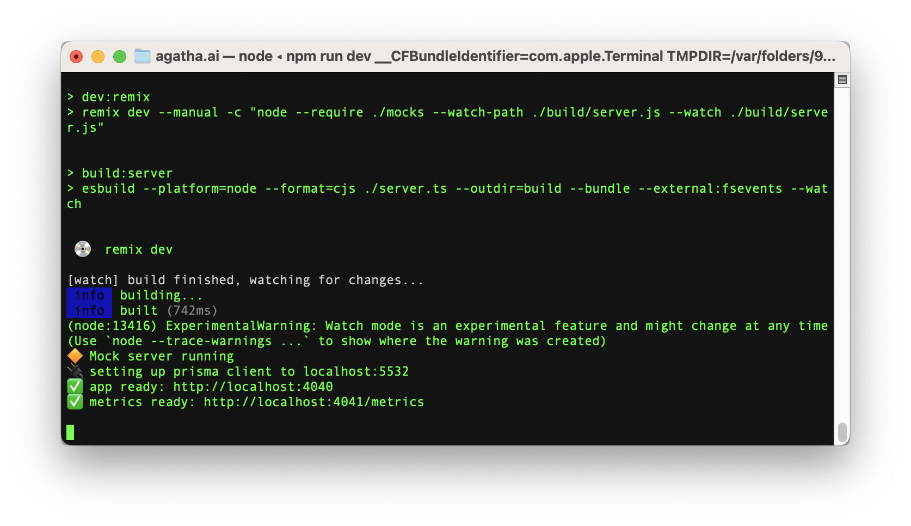
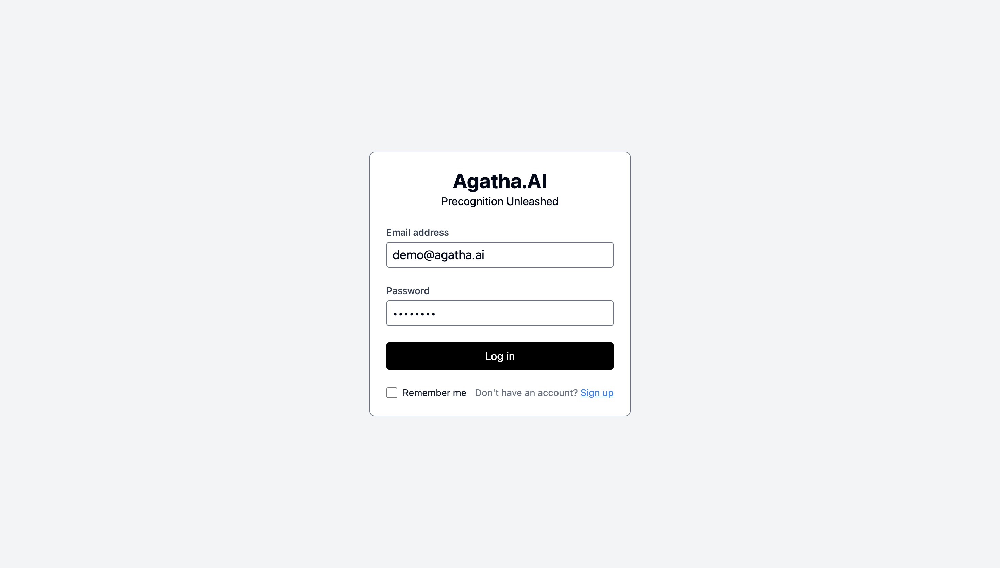
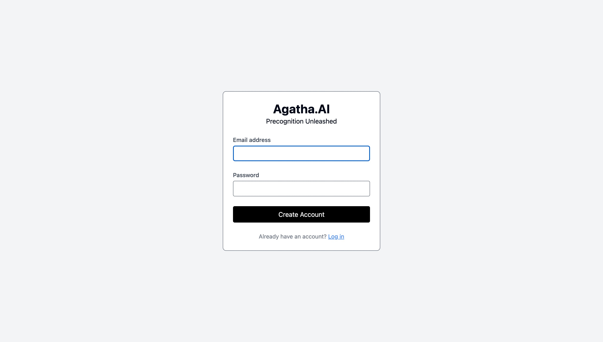
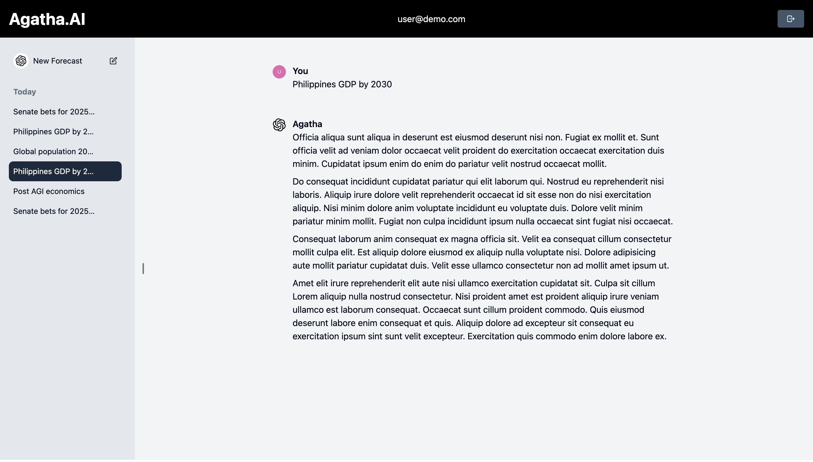
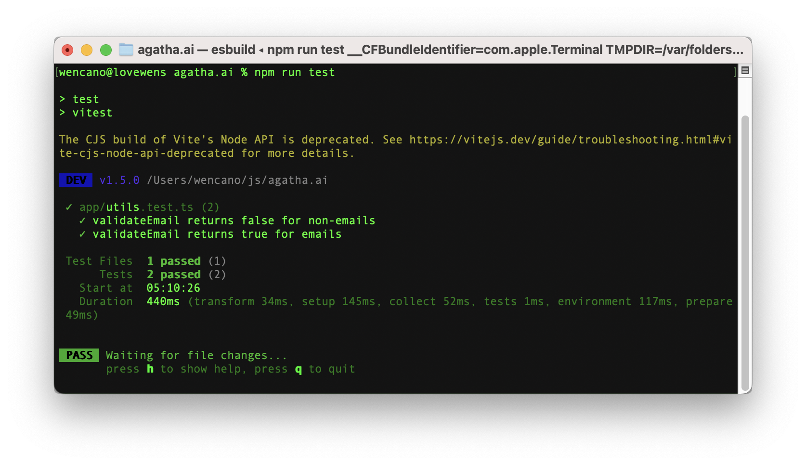
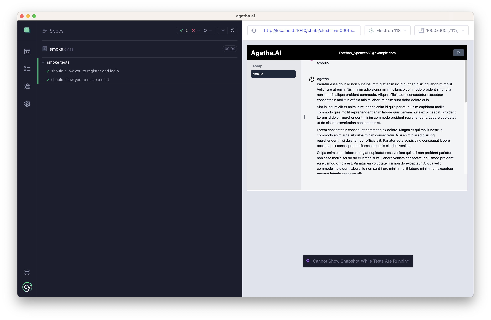

# Agatha.AI - precognition agent

[](https://wencano.com/agatha.ai)

[See Demo &raquo;](https://wencano.com/agatha.ai)

## Features
- [Remix JS](remix.run) full stack framework
- [TypeScript](https://typescriptlang.org) for static types
- [PostgreSQL](https://www.postgresql.org/) database 
- [Docker](https://www.docker.com/) for postgres container
- [httpOnly cookie](https://developer.mozilla.org/en-US/docs/Web/HTTP/Cookies) for user session
- [Prisma ORM](https://prisma.io) for database interface
- [Tailwind](https://tailwindcss.com/) for styling
- [shadcn/ui](https://shadcn.com) for design system
- [Cypress](https://cypress.io) for End-to-End testing
- [Vitest](https://vitest.dev) and [Testing Library](https://testing-library.com) for Unit testing
- [lorem-ipsum](https://www.npmjs.com/package/lorem-ipsum) for mock AI response


## Setup

Setup walkthrough:

<video controls>
  <source src="https://wencano.com/media/screen-installation.mp4" type="video/mp4">
</video>


Clone the repository

```
git clone https://github.com/wencano/agatha.ai
```

```
cd agatha.ai 
```

Create <code>.env</code> file:

```
cp .env.example .env
```

Install dependencies:
```
npm install
```

Ensure <code>docker</code> is running then run this command to create postgres container:
```
npm run docker
```

Seed postgres with sample data for user and chats:
```
npm run setup
```

```
npm run build
```

```
npm run dev
```




## Screenshots

Login Page


Signup Page


Home Page


Chat Details Page


## Unit testing with vitest

Run <code>npm run vitest</code> to run sample unit test.



## End-to-End testing with Cypress

Run <code>npm run test:e2e:dev</code> to run cypress sample tests.

